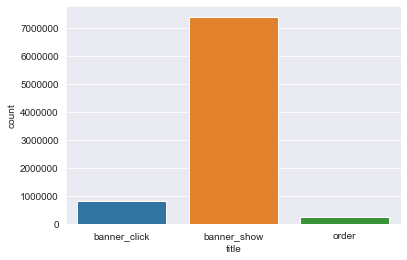
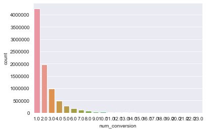

# AB_Testing 

This project uses a dataset from Kaggle (and code created by codsyp). This dataset contains information for an online sporting goods store that sells clothing, shoes, accessories, and sports nutrition items. The store’s website uses banner ads to encourage sales. The following plots can be used to visualize patterns in the data to get a picture of the impact banner ads have on their sales, as well as to get an idea of their customer’s behavior patterns while using their site.

The following graph shows the count of possible actions taken on the site: whether a banner is clicked, whether a banner is shown to a site’s user, and whether an order is placed.
 

From here, I created two binary features: 1) if a client ever clicked on a banner displayed to them and 2) if this click is the client's first conversion on the site.

 

This dataset has a time component, captured in a format year-month-date hour:minute:second. I binned the data to gain more insight on how time impacts client behavior.
